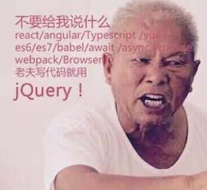

# 技术选型

## 前端技术概述

如今，前端技术与后端技术齐头并进，前端早已今非昔比，称之为"大前端"毫不为过。无数优秀的前端框架、工具再一次次刷新前端的开发效率、降低开发成本。

将前端与后端解耦的好处这里不必多说。就传统的web项目而言，无论是基于jsp、freemarker、Velocity都或多或少的将前端技术与java技术耦合，如此很难去完全发挥流行前端技术的优势。
如基于Vue（AngularJS或者React）的单页应用，完全使用restful Api与后台进行交互，一方面减少页面页面刷新次数、减少请求数据流量，另一方面数据与视图绑定技术可以减少大量直接dom操作。

选择使用新技术无疑非增加学习成本，如下图可能代表了一些同学的心态：

## RESTFul架构

RESTFul架构优点:

- 客户端-服务器结构。通过一个统一的接口来分开客户端和服务器，使得两者可以独立开发和演化。客户端的实现可以简化，而服务器可以更容易的满足可伸缩性的要求。
- 无状态。在不同的客户端请求之间，服务器并不保存客户端相关的上下文状态信息。任何客户端发出的每个请求都包含了服务器处理该请求所需的全部信息。
- 可缓存。客户端可以缓存服务器返回的响应结果。服务器可以定义响应结果的缓存设置。
- 分层的系统。在分层的系统中，可能有中间服务器来处理安全策略和缓存等相关问题，以提高系统的可伸缩性。客户端并不需要了解中间的这些层次的细节。
- 按需代码（可选）。服务器可以通过传输可执行代码的方式来扩展或自定义客户端的行为。这是一个可选的约束。
- 统一接口。该约束是 REST 服务的基础，是客户端和服务器之间的桥梁。该约束又包含下面 4 个子约束。
    - 资源标识符。每个资源都有各自的标识符。客户端在请求时需要指定该标识符。在 REST 服务中，该标识符通常是 URI。客户端所获取的是资源的表达（representation），通常使用 XML 或 JSON 格式。
    - 通过资源的表达来操纵资源。客户端根据所得到的资源的表达中包含的信息来了解如何操纵资源，比如对资源进行修改或删除。
    - 自描述的消息。每条消息都包含足够的信息来描述如何处理该消息。
    - 超媒体作为应用状态的引擎（HATEOAS）。客户端通过服务器提供的超媒体内容中动态提供的动作来进行状态转换。这也是本文所要介绍的内容。
